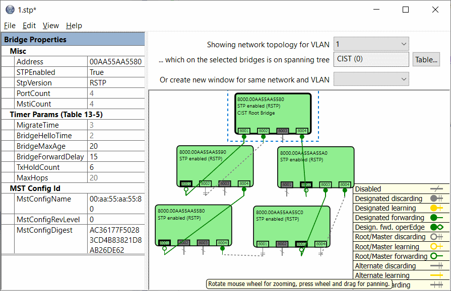

### mstp-lib
A library that implements the Multiple / Rapid Spanning Tree
Protocol as defined in 802.1Q-2018.

It's written in C++03 and is callable from C.

I integrated the library myself in various devices made by
various OEMs (ship automation, tactical networking, in-flight
entertainment) and I helped others integrate it in plenty other
devices.

### Simulator
A Simulator application for Windows is provided - both
sources and [binaries](https://github.com/adigostin/mstp-lib/releases).
The Simulator lets you create networks and see the library
in action. See the screenshot below. This is a project for
Visual Studio 2017.

### Embedded Application Example
The repository includes sources for a sample RSTP implementation
on an embedded device: a project for IAR Embedded Workbench 7.x,
for a device with an LPC2000 microcontroller and an IP175C
switch chip.

This sample highlights the platform-specific
code needed by the library -- mostly code that writes to
a few hardware registers of the switch chip. To integrate
the library in your embedded application, you'll need to
write platform-specific code for your particular switch IC.
Drop me a message at
[adigostin@gmail.com](mailto:adigostin@gmail.com)
and I'll try to help.

### API Help
The repository also includes
[help files](https://github.com/adigostin/mstp-lib/tree/master/_help)
for most of the library APIs -
[some](http://htmlpreview.github.io/?https://github.com/adigostin/mstp-lib/blob/master/_help/STP_CreateBridge.html)
[quite](http://htmlpreview.github.io/?https://github.com/adigostin/mstp-lib/blob/master/_help/StpCallback_TransmitGetBuffer.html)
[extensive](http://htmlpreview.github.io/?https://github.com/adigostin/mstp-lib/blob/master/_help/STP_OnPortEnabled.html).

### Screenshot of the Windows Simulator

