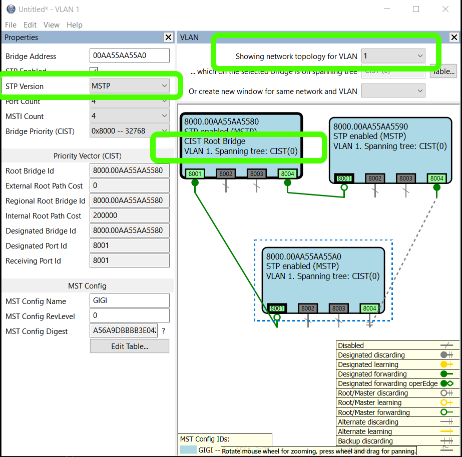

# mstp-lib
A library that implements the Multiple / Rapid Spanning Tree
Protocol, as defined in 802.1Q-2011.

It's written in C++ and is callable from C.

A Simulator application is provided that lets you create networks and see the library in action.

I integrated the library myself in devices with RSTP used
in ship automation, military equipment, avionics.
I'm aware of it being used in other products as well.

You're going to need some driver code for your particular
switch IC. Drop me a message at
[adigostin@gmail.com](mailto:adigostin@gmail.com)
and I'll try to help.

